# TradeMed

## Overview

TradeMed implements a basic web application for listing products for sale in exchange for bitcoin.

Who might use this software? Anyone who wants to sell items online and receive bitcoin while having total control over the process and with the minimal amount of software.

The main distinction from other alternatives such as WooCommerce is that privacy and anonymity are the primary design goals.
Both the website operator and all users of the web application can conduct business while remaining anonymous.
This is achieved by running the web service as a TOR hidden service and encouraging PGP communication between users.
TOR is recommended but if anonymity is not required, it can be used without TOR.

To prevent deanonymization of users there is no use of client side scripting languages.
This means a tradeoff has been made in favor of security and anonymity resulting in a basic 1990s appearance and minimal features.
The application does not utilize email in any way because it is insecure and can reveal identities.

A design goal is to be self reliant and have minimal dependencies on third party APIs or services. The only third party dependency required is for exchange rates. There is no support for external payment processors.
Apart from bitcoind, it has no other software dependences other than a few standard OS utilities.

The software automates the process of generating a set of bitcoin addresses and uploading them to the market ready to be assigned to new orders. They are signed with PGP.
See "automated pre-generated method" [here](https://en.bitcoin.it/wiki/Merchant_Howto). The addresses are saved as "watch-only" on the web server.
It was designed to use only bitcoind so support for xpub addresses was not developed.

Other digital currencies such as Litecoin can be enabled in addition to bitcoin if they use the same RPC API as bitcoind. Customers choose which payment method when placing the order.
Although the software requires bitcoind on the market system to monitor payments, the private wallet could run any wallet software.
When bitcoind is used for the private wallet then this application will automate tasks like address generation, uploading addresses to market, and processing refunds.
But if another wallet software is used, then these features would not work and a custom script to load the address set into the market would be needed.
This could be achieved by using the admin HTTP API or else updating the database table directly.

It can be run by a single vendor or it can be setup for use by multiple vendors and operate like a [darknet market](https://en.wikipedia.org/wiki/Darknet_market) where all participants are anonymous.

The software has been used in production for many years both in a single vendor setup and a multi-vendor setup. Issues with usability have been improved incrementally during that time.

See [INSTALL.md](INSTALL.md) for software requirements.

## Features

* Simple one product per order (no shopping cart). Multiple orders can optionally be paid with a single payment though.

* Each new order is assigned a unique bitcoin address from the database and the customer is given 12 hours (configurable) to make payment.

* Automatically changes status of orders to paid by checking blockchain for (at least) the required payment amount and required block confirmations.

* No bitcoin private wallet keys exists on the public web server.

* Supports segwit payment addresses or any format that bitcoind supports.

* Product management with multiple pricing options per product, shipping options, automatic picture exif removal, up to three pictures.

* Product cloning - use existing product as template when creating new products.

* Hidden products.

* Enable and disable sales of individual products.

* Stock management so avoid over-selling a product.

* Product prices, all orders are displayed in buyers currency preference.

* No dependencies on third party websites or APIs except for exchange rate updates.

* Manages order information such as [order state](app/assets/images/state_transition_diagram.jpg), quantity, exchange rates, copy of product description at order time, delivery instructions, etc.

* Order archiving for vendors (hides order from main list).

* Delivery address must be PGP encrypted or blank. To change this would involve removing a line of source code.

* Messaging system with features to make PGP communication easier.

* Allows customers to place feedback without revealing their buying history to other vendors or users of the system.

* Easy for non-technical customers to create orders. When they overpay or underpay, these cases are handled.

* Many configurable settings such as blockchain confirmations, order expiry time, supported currencies, shipping locations, product categories, site logo.

* Vendor can export order list to CSV.

* Administrator accounts for managing users, bitcoin addresses, support requests, and news updates.

* Admin can manually change state of unpaid orders to paid if they have expired or customer pays too little.

* Payments to users (ie refund transactions) can be automated, but this is optional.

* Dockerfile for quick installation and software updates.

* Two factor auth on vendor and buyer accounts using PGP (optional).

* Support for multiple vendor accounts. The roles of being a vendor on the site and the site administrator are distinct.
  The administrator may operate the site for multiple vendors for configurable commission and provide escrow and dispute resolution services.

* Vendors can list products as "no-escrow". This is for multi-vendor setups where the vendor wants to receive payment without waiting for the buyer to finalize.


## Architecture

The architecture consists of two servers. The market web server has no bitcoin private keys stored - only a list of payment address strings in the database.
The administrator generates and uploads many thousands of bitcoin addresses to the market web server database using an HTTP API.
The API requires that bitcoin addresses are PGP clearsigned so customers can verify the addresses authenticity. This helps protect against payments being made to
an attacker who subverts the market website database, or phishes customers.

The payment server runs the private bitcoin wallet and should run on your own dedicated hardware for maximum security.
It connects out to the market web server over the TOR network. This helps to conceal the location of the bitcoin wallet.
The bitcoin wallet on the payment server should also only broadcast transactions using TOR.

The payment server facilitates the bitcoin address generation by interfacing with the bitcoind RPC and GPG to create a set of addresses with PGP signatures.
The address set is stored in the application database on the payment server, then it uploads these to the market web server using the API.
It can also process refunds or vendor payments by retrieving the customer payment details from the market server and then generating a bitcoin transaction.

## Work to do

Paperclip gem is deprecated and image support needs to [migrate to ActiveStorage](https://robots.thoughtbot.com/closing-the-trombone).

Lightning payments.

Write help documentation for buyers, vendors and administration.

Litecoin payments have not been exercised in production yet.

Test suite for developers will be added to repository soon.

Many other small feature enhancements.


## Contact

tordoctor@tutanota.com

Will try to answer any questions by email.

Bitcoin donations to: bc1qar0p0el63c6hex0j832jkqc3w9tlrtda4axj84

If you have setup this application and are using it, please send bitcoin (even just a few satoshi) to the donation address and this will show how many people are using it and whether to continue releasing updates.

```
-----BEGIN PGP PUBLIC KEY BLOCK-----

mQGNBFxAYA8BDADtiUDgHN/mhBQYbclp9R8+CmSjZ2Yv88joEAFdYynCdRgYdBbD
G9h5pHcCy5P584GbyG6736WjirpGRZNCijgB/dDIiqwwGSToxkqmFi4Sq0FDcdPS
BVoyPiEmDgtz1qbJifU+8oKWIfb/nXRHUiu1I/u0Jo9vluYRiCInaoZLfJ7WWbKu
qDmHaSX8dY6plmrt+tnEI2riIFEJ5lMYsHVav18u8EFLnuYIDH9UkquUfKxXf69J
vXo+C1QAejbyJZAoea4q1GAxmGx5lfp5zA4PIva8DyLV+47oAr6DfegRQHufFahc
ZaW6wrPImcG/Ja7cbp1PuF/qVDcsEYy5X/mPg6Odq5Gbad50IIOydeCmq1eoHy6o
jk1Vm9auX4UOjJzEgqTLv9bGumXSCh3gJZL5cUF/b90llyqdY42cgaPSr98SNbHz
1uk6nazuF7YH/8lL2owpkMBB6Xl0hkkkmF62RUsA5h5cfrXab7YCiNifbcygKWLA
2xUwMxRHg03Jp5MAEQEAAbQSdHJhZGVtZWRfZGV2ZWxvcGVyiQHUBBMBCgA+FiEE
dIbHrPMnTVdNVaTQAnCf7m7lCcoFAlxAYA8CGwMFCQPCZwAFCwkIBwIGFQoJCAsC
BBYCAwECHgECF4AACgkQAnCf7m7lCcrK9Av/YtJo3rMnpvuftmu8x/q4RMUUWqYo
9zZ0EpZrveijeZ1aJlraEmOVMSEnISX+f3cJJirTTGOgZA12W9G251Lym0dIv9Z5
qqLXHc3HyzeAVj4Qd/gPfxLfxPhkOrajmOkQCNu2uLvgnIr6JdFpDh0uUpka2PMs
BblXabG1Aozb8bx5tf4YyQMO7yfvln0AxE51YulhiXXHqin0y8OqWYstuzxIT+SS
NMQstRCs7hd0/Z5HB/JLvDnpRt+8tssW/V71Rr/E37PwBKgfyj2/CuGNWKqkubpo
hVIFRV3DvGcb7Qax7xEZJfRZOiCmbjTrA57d75mQKGRYlLz+Z6Ff/SohNgqMr3+v
+iJBt+o2Ae3mx+EcRZzlGy7zS96/vFkgayPhjuzNHKiZms3e7kTdfGkPe8nRpgnt
JeSbQO7Xugm+JcSpFC+dSVWguRy9UBBMKrRlv6g9eullPby5XXB2ZguidkP/+xhA
ZfZS5rCFZOWKBIpCRAwpeO2JN776W9o/xgnnuQGNBFxAYA8BDACsEut5DwBsJXGQ
SNeqKwSq2QKlR/4JBEN8wvtMrIpPMVdzAxG5saCesAlCSRm26ssKoXhqpO9BSwn3
PBzaLXwEf7Wg3OQ02/D0ZnAgZVk8aSnwtSTTLU7DV7Dhwy7o1zEYEP+KAX5/ykkI
PkkA6oV/5V2SogQwWfU99AA9dQptThTpwBSbcIl1nV9WDjQhS3owkX8gFyM863si
dk7eR0c//4DMOs0VYWWldw+9N39eTtQCLDsnZGm6Afl5/fZuZ+KP52dnQYYGy5DC
/1JlhkSzGhVEfWktfV4DXfT7oOfOY1ztZyL2GfexspO2WPT3gkO32t+EhQxYUIN6
2vp04xkPTrEIcAmHBLtmoQhgueYV7BHk82CY3+dh56PYos3z9YvFxke0dO0K/nmQ
w4YY+Cn3Vxu0Gy3swP3vz/y216by35nnR30KjDEoq5jrQOcGEeDyMXOIfOyfgYDt
9FComnZL57jfdp3ZrgbQdCPEExRCmNbV2V22KQbqRDYQy64HvzMAEQEAAYkBvAQY
AQoAJhYhBHSGx6zzJ01XTVWk0AJwn+5u5QnKBQJcQGAPAhsMBQkDwmcAAAoJEAJw
n+5u5QnKpYQL/3BF3J5qQAo6ApZR+RMsFyme74yXVJOapJvstVI+tzrUCUaEY0q7
g69Jxun2cdr8bnrTGvEA2k2owNu6nZXnhtFgwNGEeMxzQ+K1Sum8HxSOs/Odn9Vu
+98QGEaGdrm/3/vBPTkf6cy+JqhYcGcSAq3nyw/ICfThW5vQonYOjHI8b3urjLdi
xVhvnCFm8g3wJvXbUXZIS0j2SyXOxqbcfvt96Wo2q815ium/fHilnMYeIJBiXt0a
4uryf/dj3kEqvN5T0evbureJgp997lKl1k5iO2kIdrlDIog7UA70aI9uqlX/LZH0
CnxMZVTcXbg1/VdstfJ8s4WCSU36Z8nIuOa2yOAchx1YlU92bULwsbmFXcCJZ2rA
Y54+wb54LV3hle0DJjdSQFgh2TlTnzhWnrGaMnlMdv3tjZGJFEq1XX12Pqcj/3qN
uXs3qbwtohmqS57UrifS93C21sHcrfCxQRSa0hfsGjOAIJCrqjGPGbVREpSlryXb
/qS4ntlPxcjxvA==
=G+HN
-----END PGP PUBLIC KEY BLOCK-----
```

## Screenshots

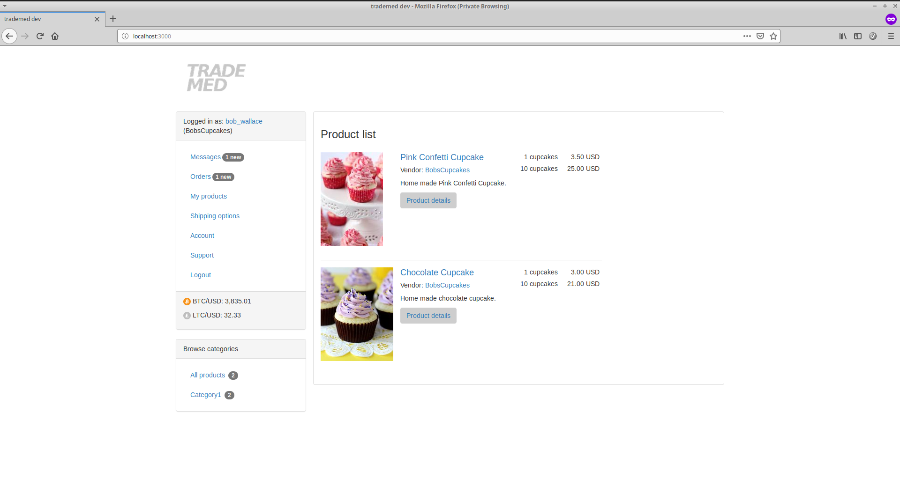

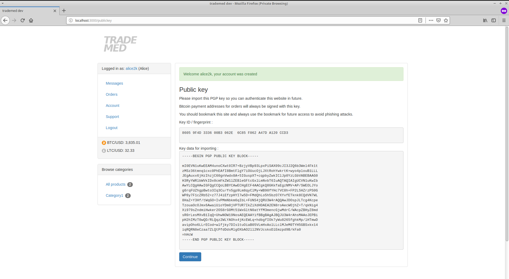

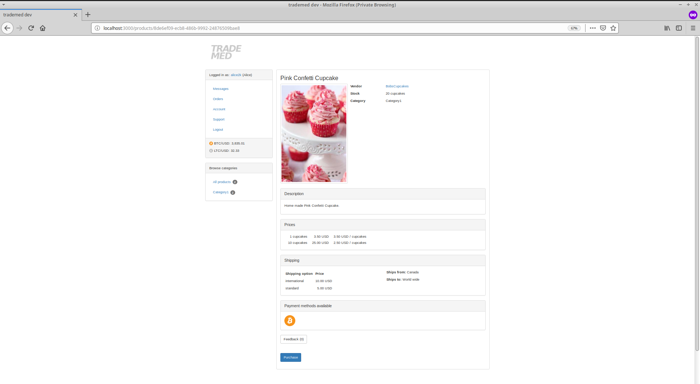

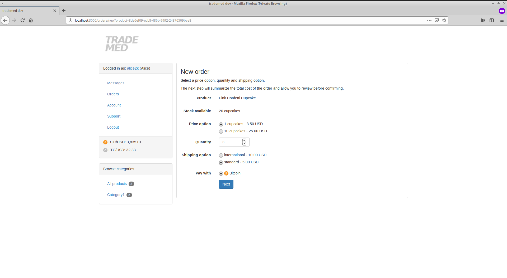

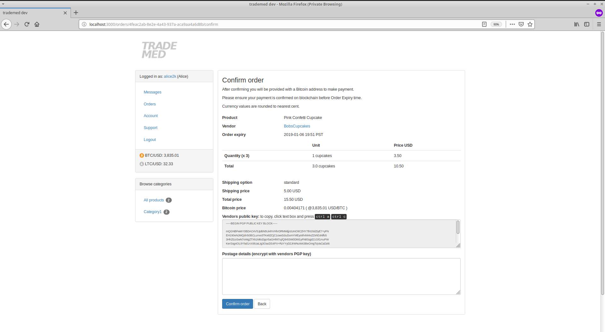

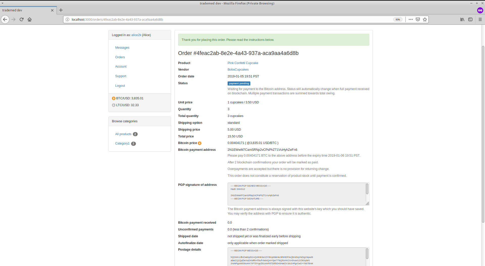

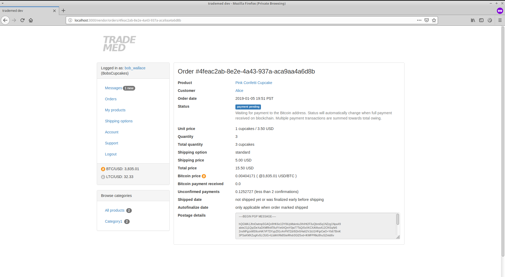

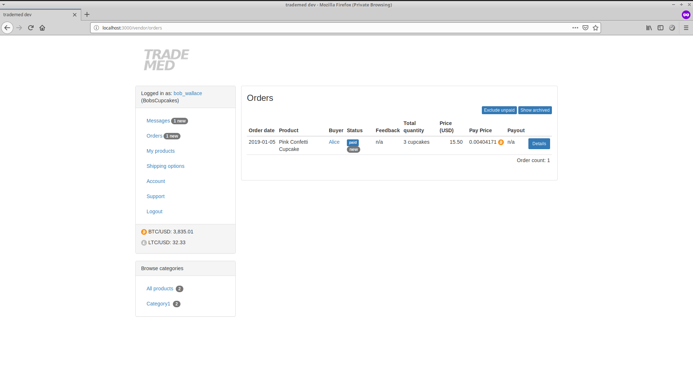

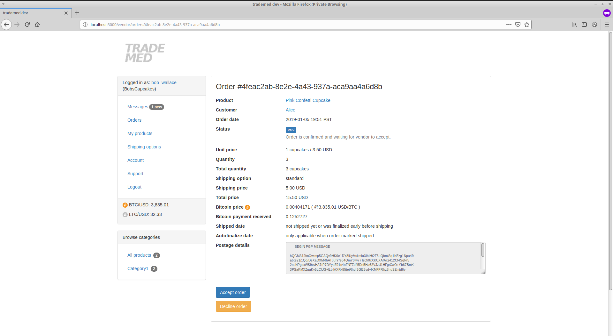

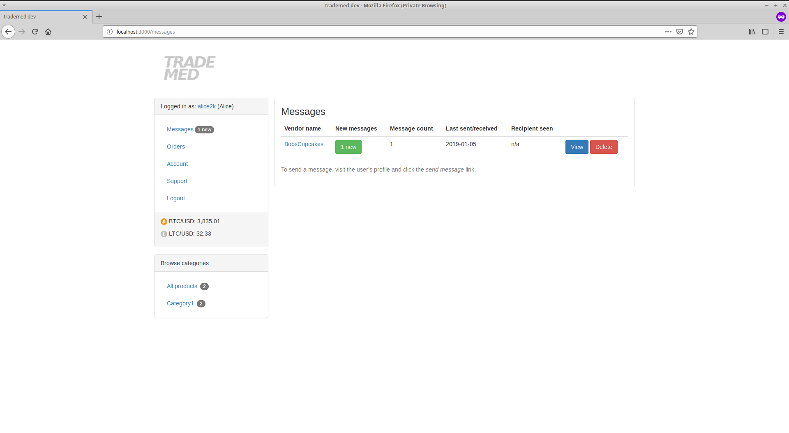

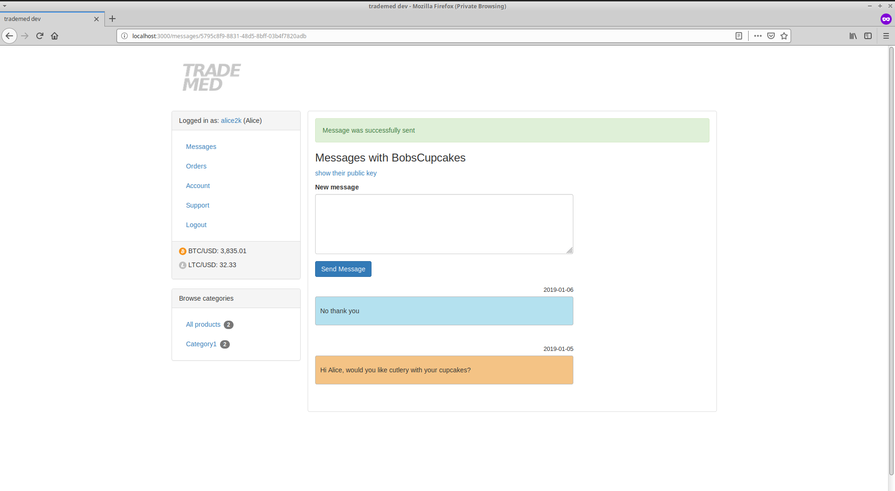

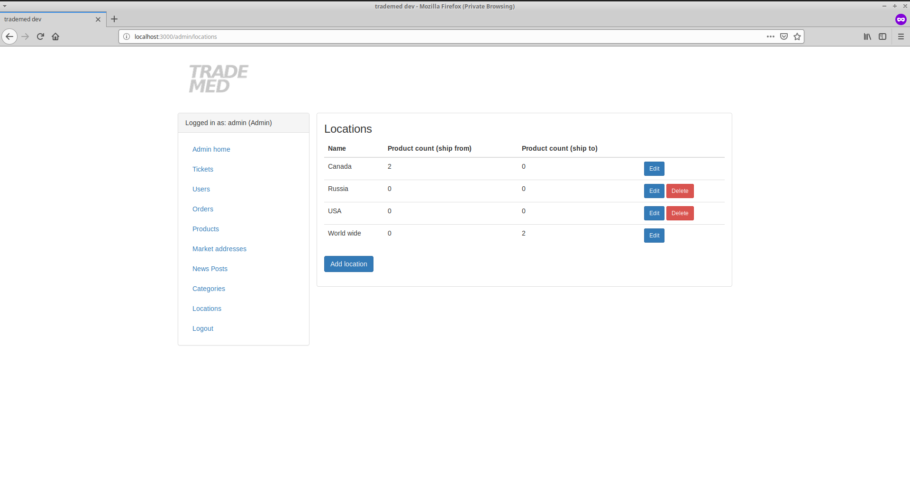

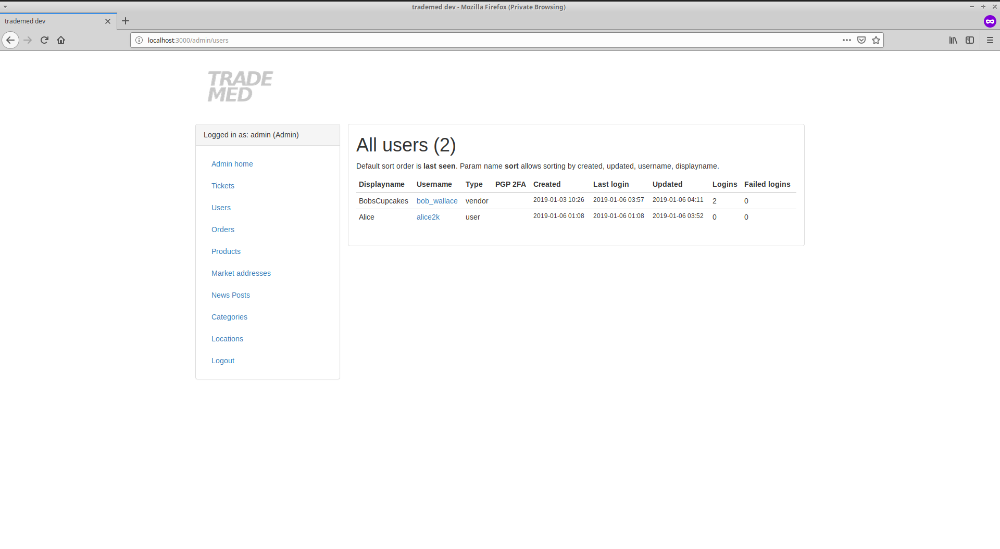

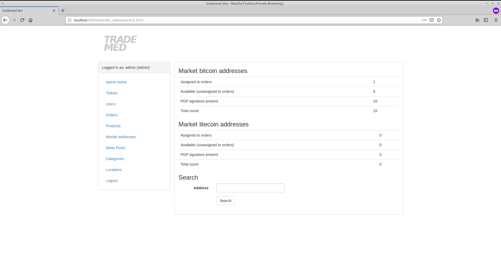
